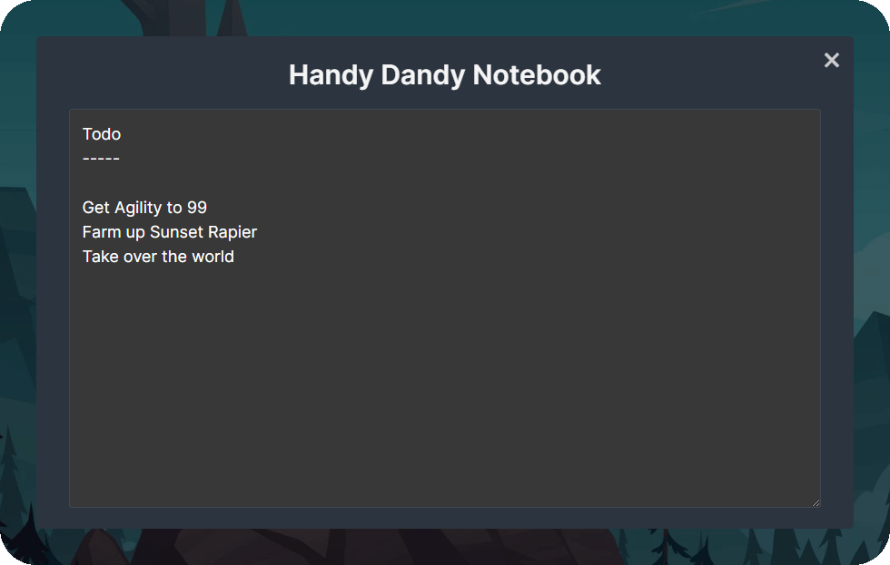

# Handy Dandy Notebook

An interactable notebook (or notepad) for jotting down information in [Melvor Idle](https://melvoridle.com/).  There are no organizational features such as pages or sections, nor will there be.  It's just a handy dandy notebook!

The notebook button can be positioned in the top bar, minibar, or sidebar.  Animations can be toggled off in settings.

Your notes are saved separately for each character.  They're synced over cloud save meaning they'll be shared between devices.  There is a limit of roughly 8,000 characters before bumping into storage restrictions.  You'll have to find somewhere else to store your new novel.

[Subscribe on mod.io](https://mod.io/g/melvoridle/m/handy-dandy-notebook) or via the Melvor Mod Manager.

## Changelog

v1.2.0 - 2023-04-17
* Moving sidebar entry position from under Modding submenu to under Bank

v1.1.1 - 2023-04-12
* Version bump for mod.io tagging

v1.1.0 - 2023-01-03
* Adding setting to choose default scroll position

v1.0.1 - 2022-10-22
* Reducing character limit to give online storage more headroom

v1.0.0 - 2022-10-22
* Initial release
